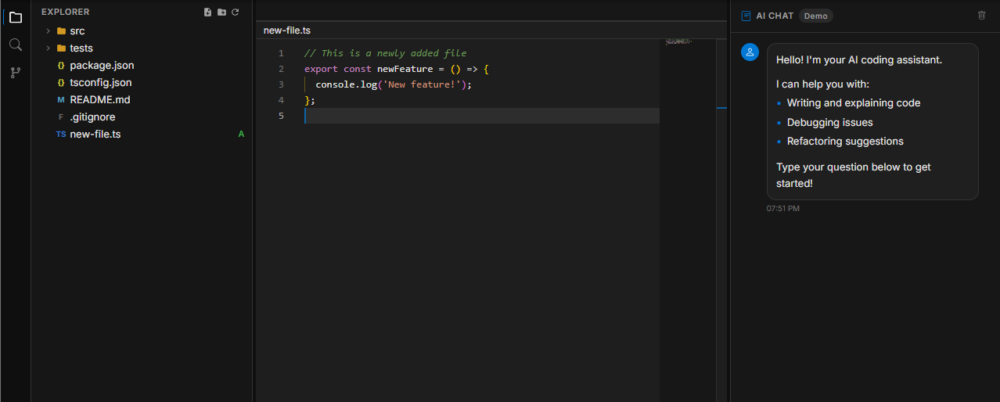

# Kode - High performance Desktop Code Editor

[](https://github.com/JesseKoldewijn/kode)
[](LICENSE)
[](https://tauri.app)

A performant, open-source desktop code editor with integrated AI chat support for CLI code agents (similar to Cursor).

## Features

- **Modern Code Editing** - Powered by Monaco Editor (VS Code's editor engine) with full IntelliSense for JavaScript/TypeScript
- **AI Chat Integration** - Built-in chat panel for interacting with CLI code agents like OpenCode
- **Syntax Highlighting** - Support for JS/TS, JSON, Markdown, CSS, HTML, Rust, Python, YAML, and more
- **File System Navigation** - Intuitive sidebar with file tree explorer
- **Integrated Terminal** - Full-featured terminal emulator with xterm.js and WebGL rendering
- **Command Palette** - Quick access to commands and file search
- **Theme Support** - Dark, light, and system theme modes
- **Fast & Lightweight** - Built with Tauri for native performance and small bundle size

## Screenshot



## Getting Started

### Prerequisites

- **Node.js** >= 25.6.0 (managed via [Volta](https://volta.sh))
- **Yarn** >= 4.12.0
- **Rust** >= 1.77.2

### Installation

You can install Kode by downloading the latest release from the [GitHub Releases](https://github.com/JesseKoldewijn/kode/releases) page.

### Browser Development Mode

For faster iteration without Tauri:

```bash
yarn dev
```

Opens at `http://localhost:1420` with mock filesystem for testing UI.

## Development

### Available Commands

| Command            | Description                             |
| ------------------ | --------------------------------------- |
| `yarn dev`         | Start Vite dev server (port 1420)       |
| `yarn tauri:dev`   | Start Tauri development with hot reload |
| `yarn build`       | Build frontend for production           |
| `yarn tauri:build` | Build Tauri desktop application         |
| `yarn format`      | Format code with Prettier               |
| `yarn test`        | Run Vitest in watch mode                |
| `yarn test:run`    | Run Vitest once                         |
| `yarn test:e2e`    | Run Playwright E2E tests                |

### Tech Stack

**Frontend:**

- [Ripple](https://ripple-ts.com) - TypeScript-first reactive UI framework
- [TailwindCSS](https://tailwindcss.com) v4 - Utility-first CSS
- [Monaco Editor](https://microsoft.github.io/monaco-editor/) - Code editor engine
- [xterm.js](https://xtermjs.org) - Terminal emulator
- [Vite](https://vitejs.dev) (rolldown-vite) - Build tool

**Backend:**

- [Tauri](https://tauri.app) - Desktop framework (Rust)
- [portable-pty](https://crates.io/crates/portable-pty) - PTY emulation
- [fuzzy-matcher](https://crates.io/crates/fuzzy-matcher) - File search
- [ignore](https://crates.io/crates/ignore) - .gitignore-aware file walking

### Architecture

Kode uses a **Tauri v2 architecture** with:

- **Frontend**: Ripple components (`.ripple` files) compiled to reactive TypeScript
- **Backend**: Rust IPC commands for filesystem, terminal, and agent operations
- **IPC**: Type-safe communication via `@tauri-apps/api`

**Key IPC Commands:**

- `read_directory`, `read_file`, `write_file` - Filesystem operations
- `spawn_terminal`, `write_terminal` - Terminal emulation
- `start_agent`, `send_to_agent` - AI agent process management

### Testing

- **Unit/Integration Tests**: Vitest with jsdom environment
- **E2E Tests**: Playwright with Tauri WebDriver
- **Mock System**: Browser development mode with mock Tauri APIs

```bash
# Run all tests
yarn test:run

# Run E2E tests
yarn test:e2e
```

## Building for Production

```bash
# Build for your platform
yarn tauri:build
```

Outputs platform-specific installers to `src-tauri/target/release/bundle/`.

## Contributing

Contributions are welcome! Please follow these guidelines:

1. Fork the repository
2. Create a feature branch (`git checkout -b feature/amazing-feature`)
3. Follow existing code style (Prettier configured)
4. Add tests for new functionality
5. Commit your changes (`git commit -m 'Add amazing feature'`)
6. Push to the branch (`git push origin feature/amazing-feature`)
7. Open a Pull Request

## License

This project is licensed under the MIT License - see the [LICENSE](LICENSE) file for details.

## Acknowledgments

- [Monaco Editor](https://microsoft.github.io/monaco-editor/) - The code editor engine that powers VS Code
- [Tauri](https://tauri.app) - For enabling lightweight desktop applications with web technologies
- [Ripple](https://ripple-ts.com) - For the reactive UI framework
- [xterm.js](https://xtermjs.org) - For the terminal emulator

---

**Built with ❤️ using Tauri, Ripple, and Rust**
